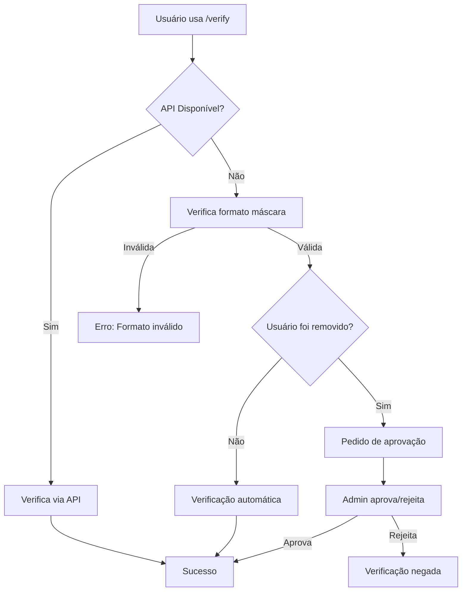

# 🎭 Sistema de Verificação por Máscara - SCARLET

## 📋 Visão Geral

O Sistema de Verificação por Máscara é um sistema de fallback que permite verificar usuários quando a API do KeyAuth está indisponível. Ele usa um formato específico de máscara para validar licenças automaticamente.

## 🔧 Formato da Máscara

**Formato Padrão:**
```
SCARLET-****-****-DURACAO
```

**Onde:**
- `SCARLET` = Prefixo fixo obrigatório
- `****` = Grupos de 4 caracteres alfanuméricos (podem ser letras minúsculas/maiúsculas e números)
- `DURACAO` = Tipo de assinatura (SEMANAL, MENSAL, TRIMESTRAL, ANUAL, VITALICIA)

## ✅ Exemplos Válidos

```
SCARLET-zxet-zqtO-SEMANAL
SCARLET-A1b2-C3d4-MENSAL
SCARLET-9876-XyZw-TRIMESTRAL
SCARLET-QwEr-TyUi-ANUAL
SCARLET-AbCd-1234-VITALICIA
```

## ❌ Exemplos Inválidos

```
SCARLET-zx-zqtO-SEMANAL          ❌ Grupos muito pequenos
SCARLET-zxet-zqtO-CUSTOM         ❌ Duração inválida
GOLD-zxet-zqtO-SEMANAL           ❌ Prefixo incorreto
SCARLET-zxet-zqtO#-SEMANAL       ❌ Caracteres especiais
```

## 🔄 Fluxo de Verificação

### 1. **Verificação Automática** ✅
Para usuários **novos** (nunca foram removidos):
- Máscara válida → Verificação imediata
- Role aplicada automaticamente
- Log registrado como `mask_verification`

### 2. **Verificação Manual** 🔍
Para usuários **previamente removidos**:
- Máscara válida → Pedido de aprovação enviado para admins
- Embed com botões de Aprovar/Rejeitar
- Administradores decidem manualmente

## 🎛️ Comandos Relacionados

### `/verify [chave]`
- Tenta verificação via API primeiro
- Se API falhar, usa verificação por máscara
- Aplica regras de auto-aprovação vs aprovação manual

### `/testmask [mask]`
- **Somente Admins**
- Testa se uma máscara é válida
- Mostra informações de duração e auto-aprovação
- Útil para debug e validação

### `/unverify [user]`
- **Somente Admins**
- Remove verificação de usuário
- Adiciona usuário à lista de "removidos"
- Próxima verificação será manual

## 🗄️ Sistema de Database

### Tabelas Utilizadas:
```json
{
  "users": [],              // Usuários verificados
  "removedUsers": [],       // Usuários que foram removidos
  "pendingApprovals": [],   // Aprovações pendentes
  "tickets": [],            // Sistema de tickets
  "logs": []               // Logs de atividades
}
```

### Estrutura de Usuário Removido:
```json
{
  "userId": "123456789",
  "licenseKey": "SCARLET-xxxx-xxxx-SEMANAL",
  "removedAt": "2024-01-15T10:30:00.000Z",
  "removedBy": "987654321"
}
```

### Estrutura de Aprovação Pendente:
```json
{
  "userId": "123456789",
  "licenseKey": "SCARLET-xxxx-xxxx-MENSAL",
  "requestedAt": "2024-01-15T11:00:00.000Z",
  "channelId": "channel_where_approval_was_sent"
}
```

## 🔧 Configuração

### 1. **Settings.json**
```json
{
  "verifiedRoleId": "ID_DA_ROLE_VERIFICADA",
  "logChannelId": "ID_DO_CANAL_DE_LOGS",
  "approvalChannelId": "ID_DO_CANAL_DE_APROVACOES"
}
```

### 2. **Permissões Necessárias**
- `Administrator` para comandos de admin
- `Manage Roles` para aplicar roles de verificação
- `Send Messages` no canal de aprovações

## 📊 Monitoramento

### Logs Automáticos:
- ✅ Verificações bem-sucedidas
- ❌ Tentativas de verificação falharam
- 🔄 Aprovações/Rejeições manuais
- 🗑️ Remoções de verificação

### Estados de Verificação:
- `api_verification` - Verificado via KeyAuth API
- `mask_verification` - Verificado via máscara automaticamente
- `manual_approval` - Aprovado manualmente por admin

## 🚨 Troubleshooting

### Problema: Máscara não aceita
**Solução:** Verificar formato exato e caracteres permitidos

### Problema: Usuário não consegue verificar
**Solução:** Verificar se foi removido anteriormente com `/listverified`

### Problema: Botões de aprovação não funcionam
**Solução:** Verificar permissões de administrador

### Problema: API sempre falha
**Solução:** Usar `/testapi` para diagnóstico

## 🔄 Workflow Completo



## 📝 Notas Importantes

1. **Segurança**: Sistema de máscara é menos seguro que API, use apenas como fallback
2. **Aprovação Manual**: Usuários removidos sempre precisam de aprovação manual
3. **Logs**: Todas as ações são registradas para auditoria
4. **Backup**: Database local salva automaticamente a cada mudança
5. **Performance**: Sistema otimizado para resposta rápida mesmo offline

---

**Desenvolvido para SCARLET® - Sistema de Verificação Avançado**